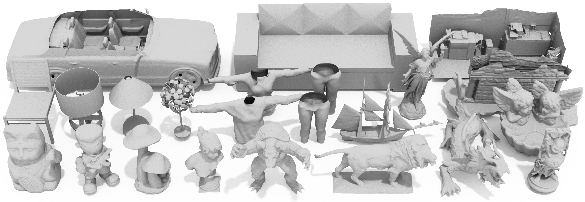

<p align="center">

  <h1 align="center">Monge-Ampere Regularization for Learning Arbitrary Shapes from Point Clouds</h1>
  <h3 align="center"><a href="https://arxiv.org/pdf/2410.18477">Paper</a> | <a href="https://chuanxiang-yang.github.io/S2DF/">Project Page</a> | <a href="https://arxiv.org/abs/2410.18477">arXiv</a> </h3>
  <div align="center"></div>
</p>
<p align="center">
  
</p>


  In this paper, we propose the scaled-squared distance function (S<sup>2</sup>DF), a novel implicit surface representation for modeling arbitrary surface types. S<sup>2</sup>DF does not distinguish between inside and outside regions while effectively addressing the non-differentiability issue of UDF at the zero level set. We demonstrate that S<sup>2</sup>DF satisfies a second-order partial differential equation of Monge-Ampere-type, allowing us to develop a learning pipeline that leverages a novel Monge-Ampere regularization to directly learn S<sup>2</sup>DF from raw unoriented point clouds without supervision from ground-truth S<sup>2</sup>DF values. 
  
## Install
    conda create -n S2DF python=3.8
    conda activate S2DF
    pip install -r requirements.txt
    conda install -c plotly plotly plotly-orca # conda only 
    # Install with instructions from https://pytorch.org/get-started/locally/
    conda install pytorch==2.0.1 torchvision==0.15.2 torchaudio==2.0.2 pytorch-cuda=11.7 -c pytorch -c nvidia

## Dataset
Please organize the data according to the following structure. We provide the input point clouds of the 3D scene.
```
│data/
├──shapenet/
│  ├── input
│  ├── ground_truth
├──3dscene/
│  ├── input
│  ├── ground_truth
...
```

## Running Surface Reconstruction
To train and test on 3D scene run 

    cd ./surface_reconstruction
    ./scripts/run_3dscene_recon.sh

If you want to reconstruct other data, please refer to ```run_3dscene_recon.sh``` and write a script accordingly.

[CAP-UDF](https://github.com/junshengzhou/CAP-UDF/tree/master/evaluation) provides excellent evaluation code.
## Thanks
Thanks to the [DiGS codebase](https://github.com/Chumbyte/DiGS), [StEik codebase](https://github.com/sunyx523/StEik) and [DCUDF codebase](https://github.com/jjjkkyz/DCUDF) off whom we built upon.

## Citation
If you find our work useful in your research, please cite our paper:

    @article{yang2024monge,
         author = {Yang, Chuanxiang and Zhou, Yuanfeng and Wei, Guangshun and Ma, Long and Hou, Junhui and Liu, Yuan and Wang, Wenping},
         title = {Monge-Ampere Regularization for Learning Arbitrary Shapes from Point Clouds},
         journal = {arXiv preprint arXiv:2410.18477},
         year = {2024},
    }
        
